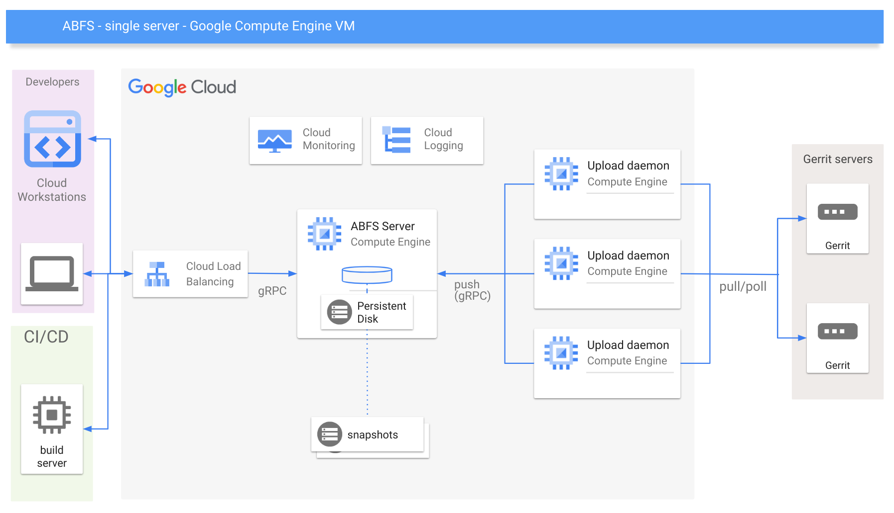

# Deploy ABFS in containers on GCE VMs

Terraform configuration for deploying ABFS containers to Google Cloud Compute
Engine VMs running [Container Optimized OS](https://cloud.google.com/container-optimized-os/docs).

This is implemented as multiple Terraform modules with an [example](./examples/simple/).

This module is divided into two distinct submodules which creates the following:

## Server

* ABFS server running Container Optimized OS and listening on port 50051 for gRPC connections
* Data disk for the ABFS server cache
* [cloud-init](https://cloud.google.com/container-optimized-os/docs/how-to/create-configure-instance#using_cloud-init_with_the_cloud_config_format)
  configuration to deploy systemd config and startup scripts for managing the lifecycle
  of the data disk (persistent disk) and the server container

## Uploaders

* Gerrit uploader server(s) also with cloud-init configuration and attached data disks

## VM startup with cloud-init and systemd

Systemd config and scripts are created on the VM by the built-in cloud-init
tool, which pulls a cloud-init config file from the metatdata server.

The cloud-init config is generated in the server's [main.tf](./modules/server/main.tf) and the uploaders [main.tf](./modules/uploaders/main.tf) and is assembled from this [systemd configuration](./cloud-init) and [associated bash scripts](./cloud-init/scripts).

Systemd is highly configurable and parallelized to allow for optimal and rapid VM
startup. The visualization below shows the order and dependencies of the relevant
systemd units.

* **abfs-datadisk.path** - waits for the persistent disk device to be attached -
  the `device name` for attached data disks is always
  `google-abfs-server-storage`
* **abfs-datadisk.service** - runs `abfs_datadisk.sh` to mount, optionally format,
  and check the data disk.
* **abfs-wait-datadisk.service** - runs `abfs_wait_datadisk.sh`, which waits for the
  data disk to be mounted
* **abfs-datadisk-ready.target** - is complete when all of the above units have run
  successfully

in parallel:

* **abfs-docker-warmup.service** - runs after the network is ready and container
  daemons are running - it runs `abfs_docker_warmup.sh` to configure docker and
  ensure that the abfs container image is pulled as early as possible

* **abfs-server.service** - Runs the ABFS container after the datadisk and docker
  image are ready.

* **fluent-bit.service** - Starts the built-in logging agent to report logs to Cloud Logging -
   [documentation](https://cloud.google.com/container-optimized-os/docs/how-to/logging)

* **node-problem-detector.service** - Starts the built-in node-problem-detector daemon,
  which reports any instance problems to Cloud Monitoring - [documentation](https://cloud.google.com/container-optimized-os/docs/how-to/monitoring), [monitored metrics](https://github.com/kubernetes/node-problem-detector/blob/master/pkg/exporters/stackdriver/stackdriver_exporter.go)

## Useful commands

* `docker ps` - check whether the container is running
* `docker logs <container id>` - view the container logs (accepts -f)
* `docker inspect <container_id>` - detailed information on the container
* `docker stats` - like `top` - shows useful info on running containers
* `sudo journalctl` - look at system logs
* `ls /etc/systemd/system/` - systemd config for ABFS
* `ls /var/run/abfs/abfs_container.env` - variables in this file are set in container's env
* `ls /var/lib/abfs/bin/` - scripts called via systemd to setup and run ABFS
* `sudo systemctl restart abfs-docker-warmup.service` - pull the latest container
* `sudo systemctl restart abfs-server.service` - restart the ABFS server
* `sudo systemctl list-dependencies abfs-server.service` - see all dependencies and status
* `sudo systemctl daemon-reload` - reload systemd config after making changes
